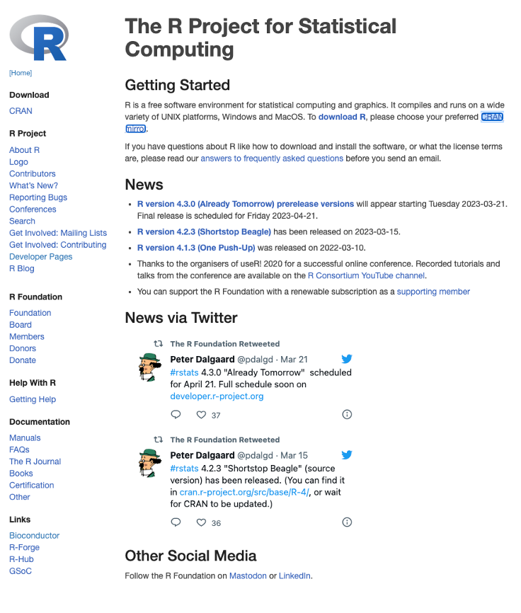
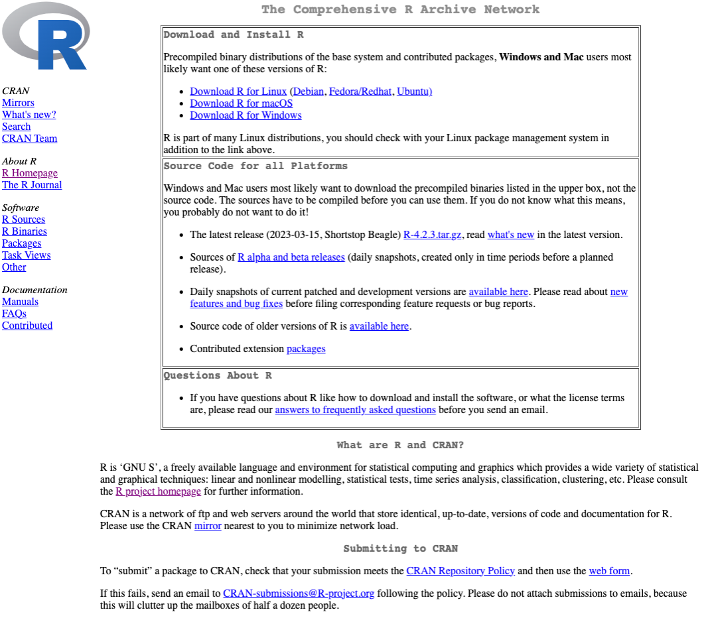
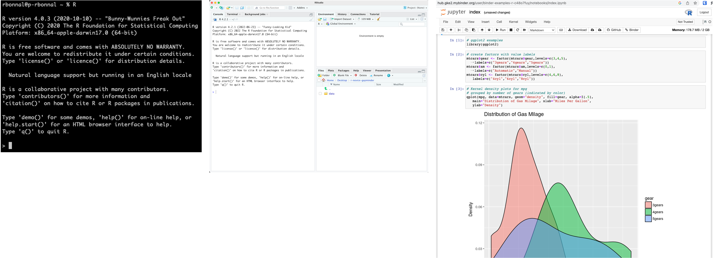
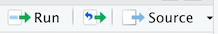
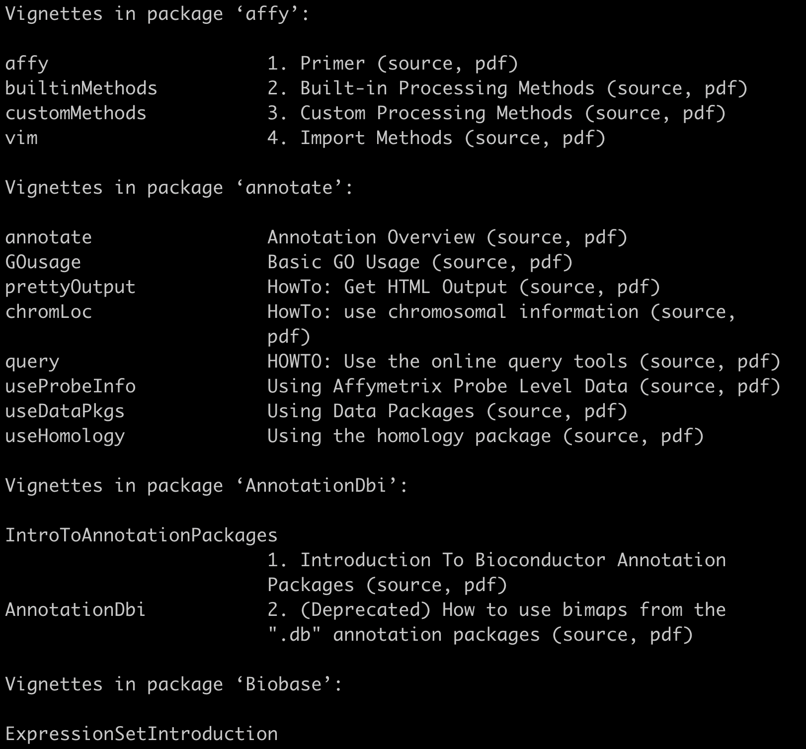
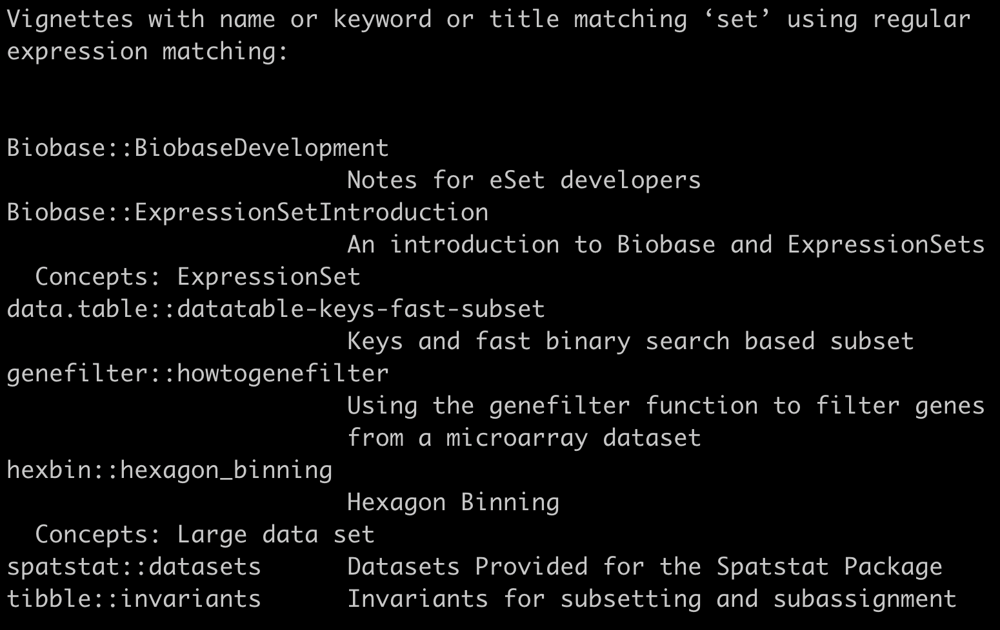
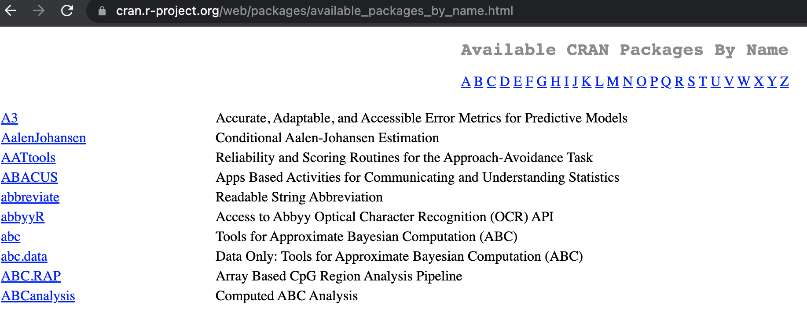
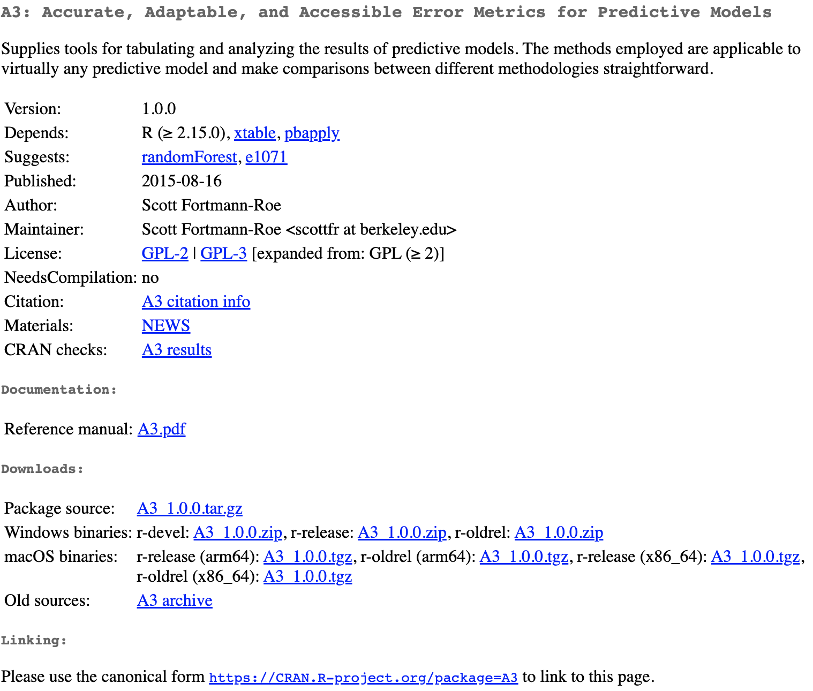
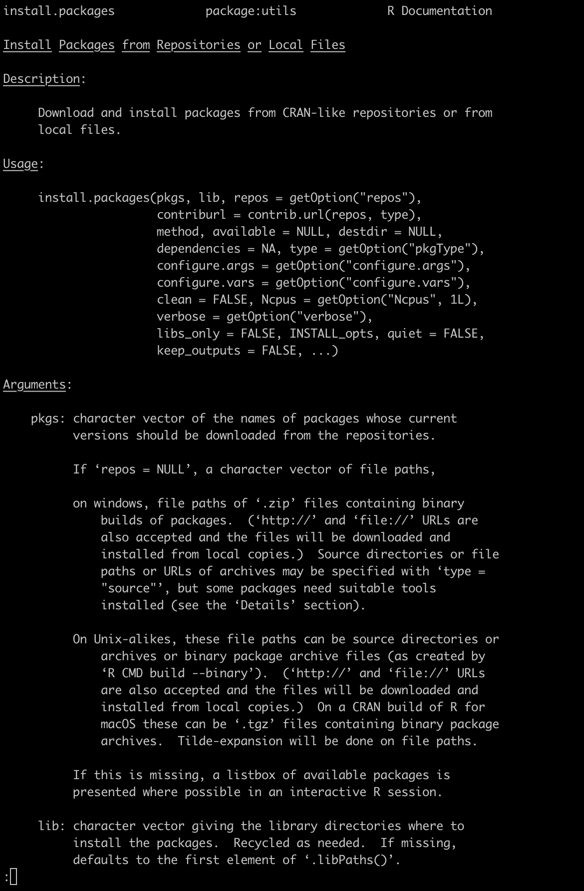
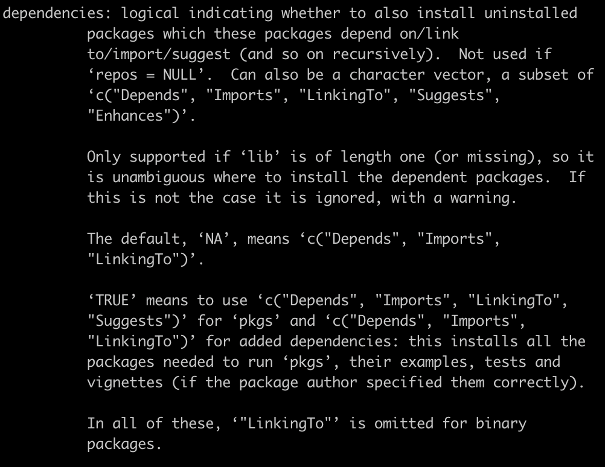

% Introduction to R
% Raoul Jean Pierre Bonnal
% 2023-03-27

# Synopsis

---

* R’s History
* Introduction to R and RStudio
* Project Management With RStudio
* Seeking Help
* Data Structures (basic)
* Packages and Libraries

---

[bfg-master-2023-course_intro2r](https://github.com/rjpbonnal/bfg-master-2023-course_intro2r)

# R's History

---

R is a programming language for statistical computing and graphics
supported by the R Core Team and the R Foundation for Statistical
Computing.

---

R is used among data miners, bioinformaticians and statisticians for data analysis and developing statistical software.

___
Users have created packages to augment the functions of the R language.

---

R is one of the most commonly used programming languages in data mining

---

As of December 2022, R ranks 11th in the TIOBE index, a measure of programming language popularity, in which the language peaked in 8th place in August 2020.

---

The official R software environment is an open-source free software environment within the GNU package, available under the GNU General Public License. 

---

It is written primarily in C, Fortran, and R itself (partially self-hosting). Precompiled executables are provided for various operating systems. 

---

R was started by professors __Ross Ihaka__ and __Robert Gentleman__ as a programming language to teach introductory statistics at the University of Auckland.

---

The name of the language comes from the shared first letter of the
authors, Ross and Robert.

---

* In Aug 1993 first shared binaries of R on the data archive StatLib and the s-news mailing list
* In Jun 1995, R free and open-source under the GNU GPL
* In Apr 1997 Mailing lists for the R project
* In Dec 1997 R officially became a GNU project
* In 1997 The R Core Team was formed
* In Feb 2000 The first official 1.0 version
* In Apr 2003 the R Foundation as a non-profit org

# R

## The project

---

https://www.r-project.org/
{width=50%}

## The network

---

__CRAN__ is a network of ftp and web servers around the world that store identical, up-to-date, versions of code and documentation for R. Please use the CRAN mirror nearest to you to minimize network load. ~90 and growing…

---

The Comprehensive R Archive Network (CRAN) was founded in 1997 by Kurt
Hornik and Fritz Leisch to host R's source code, executable files,
documentation, and user-created packages.

---

Its name and scope mimics the Comprehensive TeX Archive Network and
the Comprehensive Perl Archive Network.

---

CRAN originally had three mirrors and 12 contributed packages.
As of December 2022, it has 103 mirrors and 18,976 contributed
packages.

---

https://cran.r-project.org/
{width=60%}

## Interfaces



R has a CLI. Multiple third-party GUI: RStudio, an IDE, and Jupyter, a notebook interface.

# SetUp

## Install R

---

in your Almalinux 9 update the available system packages:

```bash
sudo dnf update
```

---

Once the update is completed, enable the EPEL and CRB on AlmaLinux 9.
```bash
sudo dnf install epel-release
sudo dnf config-manager --set-enabled crb
```

---

```bash
sudo dnf install R
```
Type `Y` when required.

---

Check the version

```bash
$ R --version
R version 4.1.3 (2022-03-10) -- "One Push-Up"
Copyright (C) 2022 The R Foundation for Statistical Computing
Platform: x86_64-redhat-linux-gnu (64-bit)

R is free software and comes with ABSOLUTELY NO WARRANTY.
You are welcome to redistribute it under the terms of the
GNU General Public License versions 2 or 3.
For more information about these matters see
https://www.gnu.org/licenses/.
```

## Run R
```bash
$ R
R version 4.1.3 (2022-03-10) -- "One Push-Up"
Copyright (C) 2022 The R Foundation for Statistical Computing
Platform: x86_64-redhat-linux-gnu (64-bit)
R is free software and comes with ABSOLUTELY NO WARRANTY.
You are welcome to redistribute it under certain conditions.
Type 'license()' or 'licence()' for distribution details.
  Natural language support but running in an English locale
R is a collaborative project with many contributors.
Type 'contributors()' for more information and
'citation()' on how to cite R or R packages in publications.
Type 'demo()' for some demos, 'help()' for on-line help, or
'help.start()' for an HTML browser interface to help.
Type 'q()' to quit R.
> 
```

## Install RStudio
[Download
RStudio](https://posit.co/download/rstudio-desktop/#download) for
Microsoft Windows

Running the RStudio under WSL2 can be a kind of *experience*

# Intro to  RStudio

## Run RStudio

Open RStudio from Microsoft Windows

---

{width=70%}

[swcarpentry](https://swcarpentry.github.io/r-novice-gapminder/01-rstudio-intro/index.html)

---

{width=70%}

## Run some code

click on the *Run* button above the editor panel, or select *Run
Lines* from the *Code* menu, or hit *Ctrl+Return* in Windows or
Linuxor *⌘+Return* on macOS.



# Project Management With R-Studio

---

[swcarpentry](https://swcarpentry.github.io/r-novice-gapminder/02-project-intro/index.html)
with rstudio

---

A good project layout will ultimately make your life easier:

* It will help ensure the integrity of your data;
* It makes it simpler to share your code with someone else (a lab-mate, collaborator, or supervisor);
* It allows you to easily upload your code with your manuscript submission;
* It makes it easier to pick the project back up after a break.

---

RStudio has the ability to create *Projects* which is self-contained
and this helps in mitigating the reproducibility problem.

---

To create a project in RStudio:

1. Click the “File” menu button, then “New Project”
2. Click “New Directory”
3. Click “New Project”
4. Type in the name of the directory to store your project, e.g. “my_project”
5. If available, select the checkbox for “Create a git repository.”
6. Click the “Create Project” button

---

That will create a *.Rproj* file in the directory of your choice. 

Double clicking on the file name RStudio will open and eventually
recovering the previous session.

---

How to recover from a previous session R uses the *.RData* which saves
the current workspace in the current working directory.

```R
save.image(file="my_workspace.RData")
```

```R
load("my_workspace.RData")
```

---

```R
save.image()
```

Creates by default a *.RData* file, an hidden file.

---

# Suggestions

---

* Treat data as read only
* Data Cleaning
* Treat generated output as disposable
* Separate function definition and application
* Save the data in the data directory
* Working directory
* Version control

## Treat Data as read only

---

Do not use a live dataset/file as input for your work.
It may change overtime and others can corrupt your "schema"

## Data Cleaning and Wrangling

---

Data can be dirty and in a wrong format.

*Cleaning* Check that data are correct, consistent

*Wrangling*  Tranform data from one format to the other. Also known as
*Data Munging*.

---

You can accomplish to this with R, the Shell, other languages, whaever
you want but you MUST track the steps with *code*.

YOUR MEMORY CAN FAIL

## Treat generated output as disposable

---

Anything generated by your scripts should be treated as disposable

* output folder w/subfolder for different analyses
* results for final output

it should all be able to be regenerated from your scripts.

## Separate function definition and application

---

Save your code into:

* *lib* for storing R functions
* *src*/*scripts* for R workflows
* *bin* for R executables or other software

## Save the data in the data directory

---

you can dowload the data from the web browser, the `wget`, `curl`,
from withing R with
```R
url<-"https://raw.githubusercontent.com/swcarpentry/r-novice-gapminder/gh-pages/_episodes_rmd/data/gapminder_data.csv"
destfile<-"./gapminder_data.csv"
download.file(url, destfile)
```

## Working directory

---

If you use *.Rproj* R sets automatically the working directory to
where your project is located.

Otherwise, remember to set it manually

---

Check the current working directory
```R
getwd()
```

Set the workging directory
```R
setwd("directory_path")
```

## Version control

In the future ;)

## Scaffold

* *data* for the input
* *bin* for external software
* *doc* for documentation
* *lib* for the funtions your wrote to better organize the code
* *src* for your `.R` scripts
* *output* for the intermediate results
* *results* for the final results

# Seeking Help

---

[swcarpentry](https://swcarpentry.github.io/r-novice-gapminder/03-seeking-help/index.html)

---

```R
?function_name
help(function_name)
```

---

Each help page is broken down into sections:

* Description: An extended description
* Usage: The arguments and their default values
* Arguments: argument is expecting
* Details: Any important details to be aware of
* Value: The data the function returns
* See Also: Any useful related functions
* Examples: How to use the function

---

Notice how related functions might call for the same help file:
```R
?write.table()
?write.csv()
```

---

*vignette* is an extended documentations with tutorials and examples

---

```R
vignette()
```
{width=60%}

---

```R
vignette(package="package-name")
```
Open a PDF

---

Fuzzy search 

```R
??function_name
```

---

```R
??set
```

{width=60%}

# Data Structures (basic)

---

[swcarpentry1](http://swcarpentry.github.io/r-novice-inflammation/13-supp-data-structures/index.html)
[swcarpentry2](https://swcarpentry.github.io/r-novice-gapminder/04-data-structures-part1/index.html)

---

5 main types:

* double
* integer
* complex
* logical
* character

---

```R
typeof(3.14)

[1] "double"
```

---

```R
typeof(1L) # The L suffix forces the number to be an integer,
           # since bydefault R uses float numbers

[1] "integer"
```

---

```R
typeof(1+1i)

[1] "complex"
```

---

```R
typeof(TRUE)

[1] "logical"
```

---

```R
typeof('banana')

[1] "character"
```

## Vectors

---

An ordered list, where  everything  must be the same type.

By default it is logical.

You can declare an empty vector of whatever type you like.

---

```R
my_vector <- vector(length = 3)
my_vector

[1] FALSE FALSE FALSE
```

---

```R
another_vector <- vector(mode='character', length=3)
another_vector

[1] "" "" ""
```

---

Inspect the type of the vector
```R
str(another_vector)

 chr [1:3] "" "" ""
```

---

```R
str(cats$weight)

num [1:3] 2.1 5 3.2
```

---

Create a vector at runtime

```R
combine_vector <- c(2,6,3)
combine_vector

[1] 2 6 3
```

---

Combining vectors
```R
ab_vector <- c('a', 'b')
ab_vector

[1] "a" "b"
```

```R
combine_example <- c(ab_vector, 'SWC')
combine_example

[1] "a"   "b"   "SWC"
```

---

Series of numbers

```R
mySeries <- 1:10
mySeries

 [1]  1  2  3  4  5  6  7  8  9 10
```

---

```R
seq(10)

 [1]  1  2  3  4  5  6  7  8  9 10
```

---

```R
seq(1,10, by=0.1)

 [1]  1.0  1.1  1.2  1.3  1.4  1.5  1.6  1.7  1.8  1.9  2.0  2.1  2.2  2.3  2.4
[16]  2.5  2.6  2.7  2.8  2.9  3.0  3.1  3.2  3.3  3.4  3.5  3.6  3.7  3.8  3.9
[31]  4.0  4.1  4.2  4.3  4.4  4.5  4.6  4.7  4.8  4.9  5.0  5.1  5.2  5.3  5.4
[46]  5.5  5.6  5.7  5.8  5.9  6.0  6.1  6.2  6.3  6.4  6.5  6.6  6.7  6.8  6.9
[61]  7.0  7.1  7.2  7.3  7.4  7.5  7.6  7.7  7.8  7.9  8.0  8.1  8.2  8.3  8.4
[76]  8.5  8.6  8.7  8.8  8.9  9.0  9.1  9.2  9.3  9.4  9.5  9.6  9.7  9.8  9.9
[91] 10.0
```

---

The `head`

```R
sequence_example <- seq(10)
head(sequence_example, n=2)

[1] 1 2
```

---

The `tail`

```R
tail(sequence_example, n=4)

[1]  7  8  9 10
```

---

Getting the length of a vector

```R
length(sequence_example)

[1] 10
```

---

Generic info

```R
class(sequence_example)

 [1] "integer"

typeof(sequence_example)

[1] "integer"
```

---

Naming elements in a vector
```R
my_example <- 5:8
names(my_example) <- c("a", "b", "c", "d")
my_example

a b c d 
5 6 7 8 

names(my_example)

[1] "a" "b" "c" "d"

my_example["a"]
a
5
```


--- 

The columns of R `data.frames` are all vectors, and that’s the root of why R forces everything in a column to be the same basic data type.

## Type coercion

```R
quiz_vector <- c(2,6,'3')

[1] "2" "6" "3"
```

---

```R
coercion_vector <- c('a', TRUE)
coercion_vector

[1] "a"    "TRUE"
```

---

```R
another_coercion_vector <- c(0, TRUE)
another_coercion_vector

[1] 0 1
```

---

The rule

`logical` -> `integer` -> `numeric` -> `complex` -> `character`

---

```R
character_vector_example <- c('0','2','4')
character_vector_example

[1] "0" "2" "4"
```

---

```R
character_coerced_to_numeric <- as.numeric(character_vector_example)
character_coerced_to_numeric

[1] 0 2 4
```

---

```R
umeric_coerced_to_logical <- as.logical(character_coerced_to_numeric)
numeric_coerced_to_logical

[1] FALSE  TRUE  TRUE
```

---

```R
cats$likes_string

[1] 1 0 1
```

```R
cats$likes_string <- as.logical(cats$likes_string)
cats$likes_string

[1]  TRUE FALSE  TRUE
```

## Data frames

___

Data frames are composed of rows and columns, where each column has
the same number of rows.

Different columns in a data frame can be made up of different data types

Everything in a given column needs to be the same type (e.g., vector, factor, or list).

---

We can create a `data.frame` at runtime
```R
cats <- data.frame(coat   = c("calico", "black", "tabby"),
                   weight = c(2.1, 5.0, 3.2),
                   likes_string = c(1, 0, 1))
```

---

read more about the difference between `<-` and `=` which are
*similar* but not the same thing
```R
?`<-`
```

[difference-between-assignment-operators](https://www.r-bloggers.com/2014/01/difference-between-assignment-operators-in-r/) by Kun Ren

---

and we can save into a file

```R
write.csv(x = cats, file = "data/feline-data.csv", row.names = FALSE)
```

---

maybe the `data` folder is not there. Try to list the folders
```R
dir()
```

---

If there is not a folder named `data`, you can create it
```R
dir.create('data')
```

---

```R
write.csv(x = cats, file = "data/feline-data.csv", row.names = FALSE)
```

---

Read it back later on
```R
cats <- read.csv(file = "data/feline-data.csv", stringsAsFactors = TRUE)
cats
```

---

```R
    coat weight likes_string
1 calico    2.1            1
2  black    5.0            0
3  tabby    3.2            1
```

---

```R
cats$weight

[1] 2.1 5.0 3.2
```

---

```R
cats$coat

[1] calico black  tabby 
Levels: black calico tabby
```

---

Apply some simple operation on all the cats

```R
## Say we discovered that the scale weighs two Kg light:
cats$weight + 2

[1] 4.1 7.0 5.2
```

---

```R
paste("My cat is", cats$coat)

[1] "My cat is calico" "My cat is black"  "My cat is tabby" 
```

---

Some error

```R
cats$weight + cats$coat

Warning in Ops.factor(cats$weight, cats$coat): '+' not meaningful for factors

[1] NA NA NA
```

---

Changing the name of some column

```R
names(cats)

[1] "coat"         "weight"       "likes_string"
```

---

```R
names(cats)[2] <- "weight_kg"
cats

    coat weight_kg likes_string
1 calico       2.1         TRUE
2  black       5.0        FALSE
3  tabby       3.2         TRUE
```

---

Using a file shared w/others errors can occour

```R
file.show("data/feline-data_v2.csv")

coat,weight,likes_string
calico,2.1,1
black,5.0,0
tabby,3.2,1
tabby,2.3 or 2.4,1
```

---

Reading the bad file
```R
cats <- read.csv(file="data/feline-data_v2.csv", stringsAsFactors = TRUE)
typeof(cats$weight)

[1] "integer"
```
The weights are not the double anymore.

---

```R
cats$weight + 2

Warning in Ops.factor(cats$weight, 2): '+' not meaningful for factors

[1] NA NA NA NA
```

## Factors

think them as categories

---

```R
coats <- c('tabby', 'tortoiseshell', 'tortoiseshell', 'black', 'tabby')
coats

[1] "tabby"         "tortoiseshell" "tortoiseshell" "black"
[5] "tabby"
```

---

```R
str(coats)

 chr [1:5] "tabby" "tortoiseshell" "tortoiseshell" "black" "tabby"
```

---

```R
CATegories <- factor(coats)
class(CATegories)

[1] "factor"

str(CATegories)

 Factor w/ 3 levels "black","tabby",..: 2 3 3 1 2
```

---

Controlling the order of factors

```R
mydata <- c("case", "control", "control", "case")
factor_ordering_example <- factor(mydata, levels = c("control", "case"))
str(factor_ordering_example)

 Factor w/ 2 levels "control","case": 2 1 1 2
```

By defaul factors are labelles in alphabelical order

## Lists

A list is a list :)

Elements in a list can have different types

---

```R
list_example <- list(1, "a", TRUE, 1+4i)
list_example

[[1]]
[1] 1

[[2]]
[1] "a"

[[3]]
[1] TRUE

[[4]]
[1] 1+4i
```

---

```R
another_list <- list(title = "Numbers", numbers = 1:10, data = TRUE )
another_list

$title
[1] "Numbers"

$numbers
 [1]  1  2  3  4  5  6  7  8  9 10

$data
[1] TRUE
```

---

Magic

```R
typeof(cats)

[1] "list"
```

a `data.frame` is a list of vectors and factors

## Matrices

a matrix

```R
matrix_example <- matrix(0, ncol=6, nrow=3)
matrix_example

     [,1] [,2] [,3] [,4] [,5] [,6]
[1,]    0    0    0    0    0    0
[2,]    0    0    0    0    0    0
[3,]    0    0    0    0    0    0
```

---

Get the size of a matrix
```R
dim(matrix_example)

[1] 3 6
```

---

```R
nrow(matrix_example)

[1] 3

ncol(matrix_example)

[1] 6
```


# Packages/Libraries

---

Every programming language:

* tries to keep the core as simple as possible.
* can be extended with functionalities that are not available in the core language.

---

Do you remmeber [CRAN](https://cran.r-project.org/web/packages/available_packages_by_name.html)?



---

{width=60%}

---

```R
> install.packages("A3")
Installing package into ‘/Users/rbonnal/Library/R/4.0/library’
(as ‘lib’ is unspecified)
--- Please select a CRAN mirror for use in this session ---
```

this is under macOS

---

```R
> install.packages("A3")
Installing package into ‘/Users/rbonnal/Library/R/4.0/library’
(as ‘lib’ is unspecified)
--- Please select a CRAN mirror for use in this session ---
```

R will download automatically all the dependencies.

---

*RTF* 
```R
> ?install.packages
```

---

{width=45%}

---

{width=70%}

